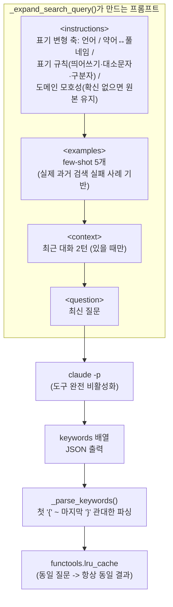

# Qcells EMS 위키봇

Confluence 라이브 검색(Atlassian Rovo Search 우선, CQL 폴백)을 배경지식으로 답하는
ChatGPT 스타일 웹 챗봇. 사이드바에서 과거 대화 기록을 열람할 수 있다.

## 구성

- `wiki_chat_server.py` — Flask 백엔드. 검색 → 컨텍스트 구성 → 답변 합성 파이프라인.
- `atlassian_mcp_client.py` — 공식 [Atlassian Rovo MCP Server](https://mcp.atlassian.com/v1/mcp)
  클라이언트. Claude Code CLI가 `claude mcp login atlassian`으로 받아둔 OAuth 토큰을 재사용한다.
- `wiki_chat_history.py` — SQLite 기반 대화 기록 저장(`conversations`/`messages`).
- `confluence_to_text.py` — Confluence storage format(XHTML) → 텍스트 변환.
- `search_query_utils.py` — 검색어 정제용 정규식 헬퍼(CQL 폴백 검색, 인물 별칭 하드코딩).
- `query_expansion.py` — 검색어 확장 프롬프트 엔지니어링 전담 모듈(`claude -p` 기반, 아래
  "검색어 확장" 절 참고).
- `static/index.html` — 프론트엔드(바닐라 JS, 사이드바 + 마크다운/mermaid 렌더링).

## 답변 합성

`claude` CLI(Claude Code, `claude -p`)가 설치돼 있으면 우선 사용한다 — 로그인된 Claude
Pro/Max 세션을 재사용하므로 별도 API 과금이 없다. CLI가 없거나 실패하면 `ANTHROPIC_API_KEY`
(Anthropic API, 유료)로 폴백하고, 그것도 없으면 로컬 [Ollama](https://ollama.com)로 폴백한다.

검색 단계에서도 `claude -p`로 검색어를 확장한다(동의어/영문 전문용어 추가, 직전 대화 맥락을
반영해 모호한 단어를 구체화) — Rovo Chat이 검색 전에 스스로 검색어를 재구성하는 동작을
모사한 것. 자세한 설계는 아래 "검색어 확장" 절 참고.

## 검색어 확장 (프롬프트 엔지니어링)

Rovo Search는 짧고 정확한 키워드에서 관련도가 훨씬 높다(예: 자연어 문장 그대로 넣으면
노이즈↑). 하지만 사용자 질문의 단어가 실제 문서의 표기와 다르면(동의어, 약어, 인물 이름의
로마자 표기 등) 그 문서를 놓친다. `query_expansion.py`가 원본 질문을 `claude -p`로 보강해
**표기가 다를 수 있는 후보들을 추가로 검색**하는 역할을 한다 — 원본 질문 자체는 항상 그대로
1차 검색되고, 확장 결과는 URL 기준으로 병합되는 보완재다(확장이 틀려도 원본 검색은 안전).

### 전체 파이프라인


### 프롬프트 구조

카테고리별로 규칙을 하나씩 나열하는 대신, "표기가 어떻게 달라질 수 있는지" 스스로 추론하는
**일반 원칙(축)** 을 주고 few-shot 예시로 패턴을 보여준다. 출력은 자유 텍스트가 아니라 JSON으로
강제해서 파싱을 견고하게 만든다.



### 표기 변형 축 (few-shot 예시 발췌)

| 축 | 설명 | 예시 질문 → 확장 키워드 |
|---|---|---|
| 언어 | 한글 ↔ 영어 동의어 | "DeviceManager 동작원리" → `architecture`, `구조`, `design` |
| 약어 ↔ 풀네임 | 약어만 있으면 풀네임을, 풀네임만 있으면 약어를 추정 | "BMS가 뭐야" → `Battery Management System`, `배터리 관리 시스템` |
| 표기 규칙 | 띄어쓰기·대소문자·구분자(마침표/하이픈/붙여쓰기) 변형 — 인물 이름에 특히 유효 | "홍길동이 뭐야" → `홍길동 프로`, `Gildong Hong`, `gildong.hong`, `gildonghong` |
| 도메인 모호성 | 여러 분야에 걸치는 용어는 확신 없으면 무리해서 확장하지 않고 원본 유지 | "gem net id ffff 아닌 예시" → `GEM Net ID`, `GEM-NET-ID` (엉뚱한 산업표준으로 확장 안 함) |
| 맥락 의존 중의성 | 직전 대화 맥락으로 모호한 단어의 의미를 확정 | "(인원 얘기 중) 로테이션으로 바꾸고 싶은데" → `Job Rotation`, `직무순환` (로그 로테이션 아님) |

**설계 원칙(왜 이렇게 짰는지)**:
- **XML 태그로 섹션 구조화** — `<instructions>`/`<examples>`/`<context>`/`<question>`을 명확히
  분리. 규칙과 가변 입력이 한 문단에 섞이면 모델이 지시를 놓치기 쉽다.
- **규칙 서술보다 few-shot 예시** — 정형화된 변형 생성 작업은 모델이 규칙 문장을 "해석"하는
  것보다 예시를 "패턴 매칭"할 때 더 안정적으로 따라온다. 예시는 실제 검색 실패 사고를 기반으로
  골라서 회귀 방지 문서 역할도 겸한다.
- **JSON 출력 강제** — 자유 텍스트("한 줄로 출력") 대신 `{"keywords": [...]}`를 요구하고, 파싱은
  코드펜스/설명이 섞여도 견고하게 처리한다.
- **동일 질문 → 동일 결과 캐싱** — LLM 호출은 확률적이라 같은 질문에도 매번 다른 키워드가
  나올 수 있다(실측: 같은 인물 질문의 검색 결과가 실행마다 달라짐). 프롬프트 문자열을 키로
  캐싱해서 재현성을 확보한다(프로세스 메모리 한정, 재시작 시 초기화).

## 실행

```bash
pip install -r requirements.txt
python3 wiki_chat_server.py --port 8010
```

`http://localhost:8010` 접속. Confluence 접근은 `claude mcp login atlassian`으로 미리 OAuth
로그인이 되어 있어야 한다(Claude Code CLI 필요). 위 로그인 없이 CQL 폴백만 쓰려면
`.env.confluence`에 `ATLASSIAN_EMAIL`/`ATLASSIAN_API_TOKEN`/`ATLASSIAN_BASE_URL`을 설정한다
(`.gitignore`에 포함되어 있으니 커밋되지 않는다).

## Claude Code 슬래시 커맨드 (`/wikibot-api`)

이 웹앱을 띄우지 않고도, **Claude Code 세션에 붙어있는 `atlassian` MCP를 직접 써서** 같은
Confluence 스페이스를 검색하고 그 결과를 지금 작업 중인 코드에 바로 반영하는 슬래시 커맨드다.
"위키봇에 물어보고 → 답변 복사 → 코드에 붙여넣기"의 2단계를 1단계로 줄인다. 커맨드 정의는
[`claude-commands/wikibot-api.md`](claude-commands/wikibot-api.md)에 있다.

### 설치

```bash
mkdir -p ~/.claude/commands
cp claude-commands/wikibot-api.md ~/.claude/commands/wikibot-api.md
```

프로젝트 한정으로만 쓰려면 `~/.claude/commands/` 대신 해당 프로젝트의 `.claude/commands/`에
복사한다.

### 필요 조건

- Claude Code에 `atlassian` MCP가 등록되어 있어야 한다(이 웹앱과 별개로, Claude Code 자체
  설정):
  ```bash
  claude mcp add --transport http atlassian https://mcp.atlassian.com/v1/mcp
  ```
  등록 후 첫 사용 시 OAuth 로그인 창이 뜬다. `claude mcp list`로 `atlassian ... Connected`가
  뜨면 준비 완료 — 이 웹앱(`wiki_chat_server.py`)의 `atlassian_mcp_client.py`, `claude -p` 합성
  파이프라인, Flask 서버 기동 중 아무것도 필요 없다.

### 사용

Claude Code 세션에서:
```
/wikibot-api <검색어 + 반영할 코드 작업 설명>
```

## 참고

- 답변 소스는 라이브 Confluence 페이지로 한정되어 있다(이 리포에는 위키 문서 자체가 포함돼
  있지 않다 — 회사별로 Confluence 스페이스 키만 `wiki_chat_server.py`의 `CONFLUENCE_SPACES`에
  맞게 바꿔서 쓰면 된다).
- 개발 서버(Flask dev server)이며 인증이 없다. 신뢰할 수 있는 네트워크 안에서만 노출할 것.
