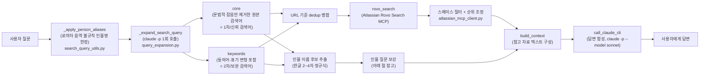
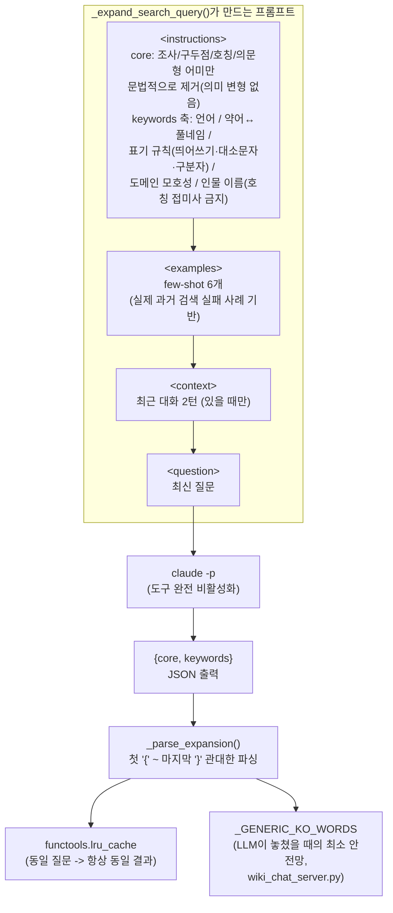
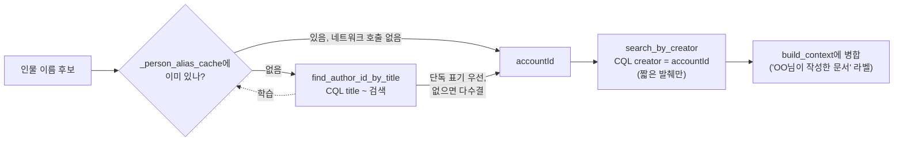

# Qcells EMS 위키봇

Confluence 라이브 검색(Atlassian Rovo Search 우선, CQL 폴백)을 배경지식으로 답하는
ChatGPT 스타일 웹 챗봇. 사이드바에서 과거 대화 기록을 열람할 수 있다.

현재 버전: **v1.2.2** — 버전별 변경 내역은
[GitHub Releases](https://github.com/HyunjeSung/qcells_ems_wikibot/releases) 참고.

## 구성

- `wiki_chat_server.py` — Flask 백엔드. 검색 → 컨텍스트 구성 → 답변 합성 파이프라인.
- `atlassian_mcp_client.py` — 공식 [Atlassian Rovo MCP Server](https://mcp.atlassian.com/v1/mcp)
  클라이언트. Claude Code CLI가 `claude mcp login atlassian`으로 받아둔 OAuth 토큰을 재사용한다.
  Rovo Search뿐 아니라 Confluence 작성자(author) 메타데이터 기반 검색(`find_author_id_by_title`/
  `search_by_creator`)과 그 결과를 재사용하는 학습 캐시(`_person_alias_cache`)도 여기 있다 —
  아래 "인물 질문 보강" 절 참고.
- `wiki_chat_history.py` — SQLite 기반 대화 기록 저장(`conversations`/`messages`).
- `confluence_to_text.py` — Confluence storage format(XHTML) → 텍스트 변환.
- `search_query_utils.py` — 검색어 정제용 정규식 헬퍼(CQL 폴백 검색용). 인물 이름의 영문 별칭
  하드코딩(`_PERSON_NAME_ALIASES`)은 **로마자 음역 자체가 불규칙한 경우 전용**(예: "김하율" →
  "Hayool Kim")으로 범위를 좁혀뒀다 — 소리로 전혀 유추 안 되는 사내 지정 영문 이름(예:
  "장승혁"의 "Jack Jang")까지 여기 하나씩 추가하지는 않는다. 대신 그런 경우는
  `atlassian_mcp_client.py`의 학습 캐시가 처리한다.
- `query_expansion.py` — 검색어 정제/확장 프롬프트 엔지니어링 전담 모듈(`claude -p` 기반, 아래
  "검색어 정제·확장" 절 참고).
- `static/index.html` — 프론트엔드(바닐라 JS, 사이드바 + 마크다운/mermaid 렌더링).

## 답변 합성

`claude` CLI(Claude Code, `claude -p`)가 설치돼 있으면 우선 사용한다 — 로그인된 Claude
Pro/Max 세션을 재사용하므로 별도 API 과금이 없다. CLI가 없거나 실패하면 `ANTHROPIC_API_KEY`
(Anthropic API, 유료)로 폴백하고, 그것도 없으면 로컬 [Ollama](https://ollama.com)로 폴백한다.

검색 단계에서도 `claude -p`로 검색어를 정제·확장한다(문법적 잡음 제거, 동의어/영문 전문용어
추가, 직전 대화 맥락을 반영해 모호한 단어를 구체화) — Rovo Chat이 검색 전에 스스로 검색어를
재구성하는 동작을 모사한 것. 자세한 설계는 아래 "검색어 정제·확장" 절 참고.

## 검색어 정제·확장 (프롬프트 엔지니어링)

Rovo Search는 짧고 정확한 키워드에서 관련도가 훨씬 높다(예: 자연어 문장 그대로 넣으면
노이즈↑). 하지만 (1) 질문 원문엔 검색에 무의미한 조사/의문형 어미/호칭이 섞여 있고, (2) 실제
문서의 표기가 질문의 단어와 다를 수 있다(동의어, 약어, 인물 이름의 로마자 표기 등). 이 둘을
`query_expansion.py`의 `_expand_search_query()` 단일 호출로 함께 처리한다 — 원래는 (1)을
정규식 불용어 목록으로, (2)를 LLM 확장으로 나눠서 처리했었는데, 불용어 목록이 새 실패
사례가 나올 때마다 계속 손으로 늘어나는 문제가 있어(2026-09-17) 둘 다 같은 LLM 호출에
맡기는 쪽으로 통합했다 — 호출 횟수는 늘지 않는다.

### 전체 파이프라인



### 프롬프트 구조

카테고리별로 규칙을 하나씩 나열하는 대신, "표기가 어떻게 달라질 수 있는지" 스스로 추론하는
**일반 원칙(축)** 을 주고 few-shot 예시로 패턴을 보여준다. 출력은 자유 텍스트가 아니라 JSON으로
강제해서 파싱을 견고하게 만든다.



### 표기 변형 축 (few-shot 예시 발췌)

| 축 | 설명 | 예시 질문 → core / keywords |
|---|---|---|
| 언어 | 한글 ↔ 영어 동의어 | "DeviceManager 동작원리 알려줘" → core `DeviceManager 동작원리` / keywords에 `architecture`, `구조`, `design` 추가 |
| 약어 ↔ 풀네임 | 약어만 있으면 풀네임을, 풀네임만 있으면 약어를 추정 | "BMS가 뭐야" → core `BMS` / keywords에 `Battery Management System`, `배터리 관리 시스템` 추가 |
| 표기 규칙 | 띄어쓰기·대소문자·구분자(마침표/하이픈/붙여쓰기) 변형 — 인물 이름에 특히 유효 | "홍길동이 뭐야" → keywords에 `Gildong Hong`, `gildong.hong`, `gildonghong` 추가 |
| 도메인 모호성 | 여러 분야에 걸치는 용어는 확신 없으면 무리해서 확장하지 않고 원본 유지 | "gem net id ffff 아닌 예시 찾아줘" → core `gem net id ffff 아닌 예시` / keywords에 `GEM Net ID`, `GEM-NET-ID` 추가(엉뚱한 산업표준으로 확장 안 함) |
| 맥락 의존 중의성 | 직전 대화 맥락으로 모호한 단어의 의미를 확정 | "(인원 얘기 중) 로테이션으로 바꾸고 싶은데" → core `Energy SW 담당업무 로테이션` (로그 로테이션 아님) |
| 인물 이름 호칭 | "프로"/"님"/"씨" 같은 범용 호칭 접미사는 core에서도 keywords에서도 제거 | "jack jang/장승혁 프로가 누구야?" → core `jack jang 장승혁`(호칭·구분자 제거) — "프로"를 붙이면 그 단어가 거의 모든 사람 이름에 습관적으로 붙어 있어(특히 주간업무 보고서) 특정 인물을 전혀 구분 못 하고, 오히려 그 단어가 잔뜩 반복되는 다른 사람 문서가 검색 상위로 올라온다(실측) |

**설계 원칙(왜 이렇게 짰는지)**:
- **XML 태그로 섹션 구조화** — `<instructions>`/`<examples>`/`<context>`/`<question>`을 명확히
  분리. 규칙과 가변 입력이 한 문단에 섞이면 모델이 지시를 놓치기 쉽다.
- **규칙 서술보다 few-shot 예시** — 정형화된 변형 생성 작업은 모델이 규칙 문장을 "해석"하는
  것보다 예시를 "패턴 매칭"할 때 더 안정적으로 따라온다. 예시는 실제 검색 실패 사고를 기반으로
  골라서 회귀 방지 문서 역할도 겸한다.
- **JSON 출력 강제** — 자유 텍스트("한 줄로 출력") 대신 `{"core": "...", "keywords": [...]}`를
  요구하고, 파싱은 코드펜스/설명이 섞여도 견고하게 처리한다.
- **동일 질문 → 동일 결과 캐싱** — LLM 호출은 확률적이라 같은 질문에도 매번 다른 결과가 나올
  수 있다(실측: 같은 인물 질문의 core 정제 정도나 검색 결과가 실행마다 달라짐). 프롬프트
  문자열을 키로 캐싱해서 재현성을 확보한다(프로세스 메모리 한정, 재시작 시 초기화).
- **정규식 목록보다 LLM 일반화 우선** — 새로운 잡음 패턴(호칭, 의문형 어미, 구분자 등)이
  나올 때마다 정규식 불용어 목록에 항목을 추가하는 대신, 이미 쓰고 있는 LLM 호출이 그 패턴을
  일반화해서 처리하게 한다(위 "검색어 정제·확장" 절 참고). 다만 LLM은 100% 결정적이지 않으므로,
  실제로 사고를 낸 적 있는 단어만 담은 작은 정규식 안전망(`_GENERIC_KO_WORDS`)은 최후 방어선으로
  유지한다.

## 인물 질문 보강 (Confluence 작성자 메타데이터)

"OO가 누구야"류 질문은 본문 텍스트 검색만으로는 약하다 — 예산 품의서·회의록처럼 그 사람의
실제 업무를 보여주는 문서일수록, 작성자 본인이 자기 이름을 문서 안에 잘 안 쓰기 때문이다.
반면 Confluence는 페이지마다 "누가 만들었나"(`authorId`) 메타데이터를 갖고 있다 — 이미
매 페이지 조회(`getConfluencePage`)에 포함돼 있지만 예전엔 버려지고 있었다.

### 동작 방식

1. 질문에서 뽑은 인물 이름 후보(예: "장승혁")로 Confluence를 **CQL `title ~` 직접 검색**해서
   그 이름이 제목에 든 문서를 찾는다(`find_author_id_by_title`). Rovo Search의 불투명한 랭킹을
   거치지 않아서, "jack"/"jang" 같은 흔한 영단어가 질의에 섞여도 영향을 안 받는다(처음엔
   Rovo 검색 결과에서 우연히 찾는 방식이었는데, 이 노이즈 때문에 자주 실패해서 CQL 직접
   검색으로 바꿨다).
2. 같은 이름이 제목에 있어도 실제 작성자는 다를 수 있다(공동 발명자로 이름만 올라간 특허
   문서 등) — 제목의 맨 앞 괄호가 **그 이름 단독**으로만 된 문서("(장승혁) ...")를 최우선
   신뢰 신호로 채택하고, 없으면 다수결로 폴백한다.
3. 찾은 계정(`accountId`)으로 CQL `creator = "<accountId>"` 검색을 돌려서 그 사람이 작성한
   모든 문서를 찾는다(`search_by_creator`) — 전체 본문을 다 받지 않고 짧은 발췌(excerpt)만
   써서 가볍게 처리한다.
4. **학습 캐시**(`_person_alias_cache`): 1번에서 찾은 계정의 실제 표시 이름(예: "Jack Jang
   (Unlicensed)" — "장승혁"의 사내 지정 영문 이름으로, Seunghyeok과 음성적 연관이 전혀 없어
   로마자 음역 추측으로는 절대 못 맞힘)을 그 자리에서 기억해둔다. 그 뒤로는 한글 이름이든
   영문 이름이든 어느 쪽으로 물어도 네트워크 호출 없이 바로 같은 계정으로 풀린다 — **사람마다
   코드에 별칭을 하드코딩하는 대신, 실제 조회 결과를 재사용하는 일반 메커니즘**이다(프로세스
   메모리 한정, 재시작 시 비워짐 — 그 뒤 첫 질문이 한글 이름 없이 영문 별칭만 쓴 경우는 원천적
   한계로 못 찾을 수 있다. `lookupJiraAccountId` 유저 디렉터리 조회는 라이선스가 해지된
   계정은 검색 대상에서 빠져서 이 경우엔 쓸 수 없다는 것도 확인됨).



## 실행

```bash
pip install -r requirements.txt
python3 wiki_chat_server.py --port 8010
```

`http://localhost:8010` 접속. Confluence 접근은 `claude mcp login atlassian`으로 미리 OAuth
로그인이 되어 있어야 한다(Claude Code CLI 필요). 위 로그인 없이 CQL 폴백만 쓰려면
`.env.confluence`에 `ATLASSIAN_EMAIL`/`ATLASSIAN_API_TOKEN`/`ATLASSIAN_BASE_URL`을 설정한다
(`.gitignore`에 포함되어 있으니 커밋되지 않는다).

## Claude Code 슬래시 커맨드 (`/wikibot-api`)

이 웹앱을 띄우지 않고도, **Claude Code 세션에 붙어있는 `atlassian` MCP를 직접 써서** 같은
Confluence 스페이스를 검색하고 그 결과를 지금 작업 중인 코드에 바로 반영하는 슬래시 커맨드다.
"위키봇에 물어보고 → 답변 복사 → 코드에 붙여넣기"의 2단계를 1단계로 줄인다. 커맨드 정의는
[`claude-commands/wikibot-api.md`](claude-commands/wikibot-api.md)에 있다.

### 설치

```bash
mkdir -p ~/.claude/commands
cp claude-commands/wikibot-api.md ~/.claude/commands/wikibot-api.md
```

프로젝트 한정으로만 쓰려면 `~/.claude/commands/` 대신 해당 프로젝트의 `.claude/commands/`에
복사한다.

### 필요 조건

- Claude Code에 `atlassian` MCP가 등록되어 있어야 한다(이 웹앱과 별개로, Claude Code 자체
  설정):
  ```bash
  claude mcp add --transport http atlassian https://mcp.atlassian.com/v1/mcp
  ```
  등록 후 첫 사용 시 OAuth 로그인 창이 뜬다. `claude mcp list`로 `atlassian ... Connected`가
  뜨면 준비 완료 — 이 웹앱(`wiki_chat_server.py`)의 `atlassian_mcp_client.py`, `claude -p` 합성
  파이프라인, Flask 서버 기동 중 아무것도 필요 없다.

### 사용

Claude Code 세션에서:
```
/wikibot-api <검색어 + 반영할 코드 작업 설명>
```

## 참고

- 답변 소스는 라이브 Confluence 페이지로 한정되어 있다(이 리포에는 위키 문서 자체가 포함돼
  있지 않다 — 회사별로 Confluence 스페이스 키만 `wiki_chat_server.py`의 `CONFLUENCE_SPACES`에
  맞게 바꿔서 쓰면 된다).
- 개발 서버(Flask dev server)이며 인증이 없다. 신뢰할 수 있는 네트워크 안에서만 노출할 것.
