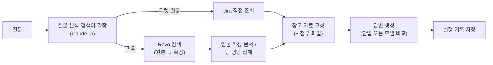

# Qcells EMS 위키봇

사내 Confluence·Jira를 실시간으로 검색해 답하는 웹 챗봇. 화면은
[expharness](https://ml.bridge.infoedu.co.kr/project/build)의 작업대 구성을 따른다 — 가운데 대화,
오른쪽 "작업대"에 답변이 만들어지는 단계를 실시간으로 보여주고, 모든 질문을 실행 기록으로 남긴다.

현재 버전: **v2.0.0** — 변경 내역은 [GitHub Releases](https://github.com/HyunjeSung/qcells_ems_wikibot/releases) 참고.

## 주요 기능

- **작업대**: 질문 분석 → 검색 → 인물·Jira 보강 → 답변 생성 → 채점·채택 → 저장 단계를 실시간 표시.
  새로고침해도 진행 중인 답변을 이어서 보여주고, 같은 대화에 답변 중이면 새 질문은 거절한다.
- **모델 비교**: 여러 모델이 같은 자료로 답한 뒤, 어느 모델인지 가린 채 채점해(심사 70% + 규칙 30%)
  더 나은 답을 채택한다. 기본 모델은 3점 이상 앞서야 교체. 기본값은 꺼짐.
- **Jira 질문**: "티켓"이 들어간 질문은 Rovo 문서 검색 대신 Jira를 직접 조회한다
  (한 사람: 진행 중 담당 이슈, 팀 전체: 명단 인원별 진행 중 할당 수).
- **파일 첨부**: 텍스트·로그·CSV·코드·xlsx·docx·pptx·pdf(파일당 20MB)를 답변 근거로 사용.
- **실행 기록**: 작업("새 작업"으로 시작한 대화) 단위 목록, 누르면 대화 전문을 읽기 전용으로 표시.
  삭제는 소프트 삭제라 관리자 화면에는 남는다.
- **관리자 화면**(`--admin`): 전체 사용자의 작업과 처리 과정 재생, 사용자 계정 관리.

## 구성

| 파일 | 역할 |
|---|---|
| `wiki_chat_server.py` | Flask 서버. 검색 → 참고 자료 구성 → 답변 생성 파이프라인, API |
| `query_expansion.py` | 검색어 정제·확장(`claude -p` 1회 호출, JSON 출력). 설계 배경은 파일 내 주석 |
| `atlassian_mcp_client.py` | Atlassian Rovo MCP 클라이언트 — Rovo 검색, Confluence 작성자 검색, 팀 명단 |
| `jira_client.py` | Jira 조회(인물 계정 매칭, 담당 이슈 검색) |
| `model_arena.py` | 모델 비교(병렬 생성, 블라인드 심사, 채택 판정) |
| `run_trace.py` | 처리 단계 이벤트 수집(작업대 스트리밍, 실행 기록 저장) |
| `file_store.py` | 업로드 파일 저장·텍스트 추출 |
| `wiki_chat_history.py` | SQLite 저장소(대화·메시지·사용자·실행 기록·파일) |
| `static/` | `index.html`(사용자), `admin.html`(관리자), `app.css`·`markdown.js`(공용) |

## 처리 흐름


```mermaid
flowchart LR
    Q[질문] --> E["질문 분석·검색어 확장\n(claude -p)"]
    E -->|티켓 질문| J[Jira 직접 조회]
    E -->|그 외| R["Rovo 검색\n(원본 → 확장)"]
    R --> P["인물 작성 문서 /\n팀 명단 집계"]
    J --> C["참고 자료 구성\n(+ 첨부 파일)"]
    P --> C
    C --> G["답변 생성\n(단일 또는 모델 비교)"] --> S[실행 기록 저장]
```

답변 모델은 `claude -p`(로그인된 Claude 세션, 별도 과금 없음)가 기본이고, 없으면
`ANTHROPIC_API_KEY` → 로컬 Ollama 순으로 폴백한다. 화면에서 `claude:sonnet`(기본)·`opus`·`haiku`·
`ollama:*` 중 고를 수 있다.

## 실행

```bash
pip install -r requirements.txt
cp wikibot.env.example wikibot.env    # 값 채우기
set -a; source wikibot.env; set +a
python3 wiki_chat_server.py --port 8010            # 사용자 화면
python3 wiki_chat_server.py --port 18011 --admin   # 관리자 화면
```

Confluence/Jira 접근은 `claude mcp login atlassian`으로 OAuth 로그인이 되어 있어야 한다.

| 변수(`wikibot.env`) | 용도 |
|---|---|
| `WIKIBOT_VERSION` | 화면 버전 배지(릴리스 태그와 맞춤) |
| `ADMIN_USERNAME` / `ADMIN_PASSWORD_HASH` | 관리자 로그인 |
| `ADMIN_SECRET_KEY` | 세션 쿠키 서명 키(비우면 재시작마다 세션이 끊김) |
| `WIKIBOT_COMPARE_MODELS` / `WIKIBOT_JUDGE_MODEL` | 모델 비교 기본 후보 / 심사 모델 |
| `GMAIL_ADDRESS` / `GMAIL_APP_PASSWORD` | "수정요청" 메일 발신 |

### Pi 배포

`wikibot-pi`에서 systemd 서비스 두 개로 돈다(`qcells-wikibot` 8010, `qcells-wikibot-admin` 18011).

1. Pi에서 DB 백업: `cp -p .wiki_chat_history.db .wiki_chat_history.db.bak-<날짜>`
2. 앱 코드만 rsync(`.wiki_chat_history.db*`, `wikibot.env`, `venv`, `uploads`, `.git` 제외)
3. 진행 중인 답변이 없을 때 두 서비스 재시작(`static/`만 바뀌었으면 재시작 불필요)

DB 스키마 변경은 서버 시작 시 자동 적용된다. 접속 장애 복구는 `scripts/recover_wikibot_pi.sh`.

## `/wikibot-api` 슬래시 커맨드

웹앱 없이 Claude Code 세션의 `atlassian` MCP로 Confluence를 검색해 코드 작업에 바로 반영한다.

```bash
cp claude-commands/wikibot-api.md ~/.claude/commands/
claude mcp add --transport http atlassian https://mcp.atlassian.com/v1/mcp
```

사용: `/wikibot-api <검색어 + 반영할 코드 작업>`

## 참고

- 검색 대상 Confluence 스페이스는 `wiki_chat_server.py`의 `CONFLUENCE_SPACES`에서 바꾼다.
- Flask 개발 서버이고 비밀번호가 평문 저장되는 등 사내 LAN 전용 구조다. 신뢰할 수 있는 네트워크에만 노출할 것.
