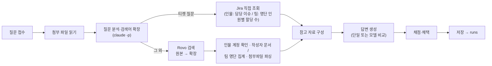
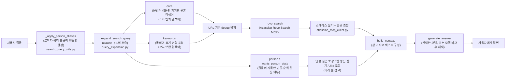
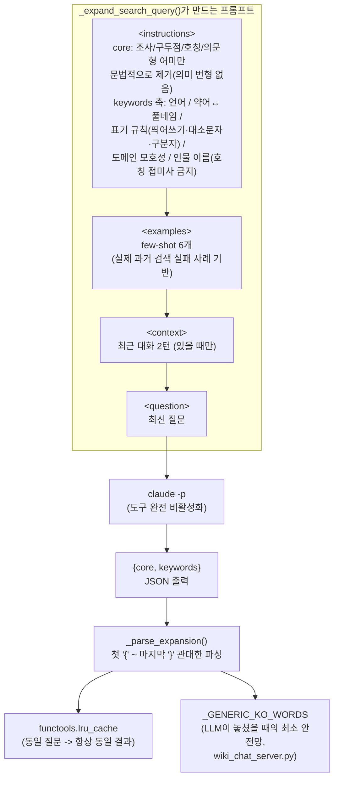
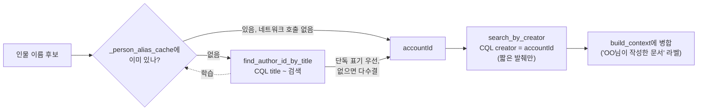

# Qcells EMS 위키봇

Confluence 라이브 검색(Atlassian Rovo Search 우선, CQL 폴백)과 Jira를 배경지식으로 답하는 웹 챗봇.
v2.0.0부터 화면을 [expharness](https://ml.bridge.infoedu.co.kr/project/build)의 작업대 구성으로
바꿨다 — 가운데 대화, 오른쪽 "작업대"에 답변이 만들어지는 단계(검색 → 보강 → 생성 → 채점·채택)를
실시간으로 보여주고, 모든 질문을 실행 기록으로 남긴다. 여러 모델로 답하게 한 뒤 블라인드 채점으로
더 나은 답을 채택하는 "모델 비교" 모드와 파일 첨부도 지원한다.

현재 버전: **v2.0.0** — 버전별 변경 내역은
[GitHub Releases](https://github.com/HyunjeSung/qcells_ems_wikibot/releases) 참고.

## 구성

- `wiki_chat_server.py` — Flask 백엔드. 검색 → 컨텍스트 구성 → 답변 합성 파이프라인.
- `atlassian_mcp_client.py` — 공식 [Atlassian Rovo MCP Server](https://mcp.atlassian.com/v1/mcp)
  클라이언트. Claude Code CLI가 `claude mcp login atlassian`으로 받아둔 OAuth 토큰을 재사용한다.
  Rovo Search뿐 아니라 Confluence 작성자(author) 메타데이터 기반 검색(`find_author_id_by_title`/
  `search_by_creator`)과 그 결과를 재사용하는 학습 캐시(`_person_alias_cache`)도 여기 있다 —
  아래 "인물 질문 보강" 절 참고.
- `wiki_chat_history.py` — SQLite 저장소(`conversations`/`messages`/`users`, v2.0.0부터 실행 기록
  `runs`와 업로드 파일 `files`). 실행 기록·메시지는 소프트 삭제(`deleted_at`)라 관리자 화면에는 남는다.
- `run_trace.py` — 답변 파이프라인 단계 이벤트 수집. `/api/chat/stream`이 NDJSON으로 흘려보내 작업대가
  실시간 갱신되고, 끝나면 `runs`에 통째로 저장돼 실행 기록에서 그대로 재생된다.
- `model_arena.py` — 모델 비교 모드. 후보 모델 병렬 생성 → 블라인드 LLM 심사 70% + 규칙 점수 30% →
  기본 모델을 바꾸려면 `ADOPT_MARGIN`(3점) 이상 앞서야 채택.
- `file_store.py` — 업로드 파일 저장/텍스트 추출(텍스트·코드·CSV·xlsx·docx·pptx·pdf). 대화에 첨부하면
  추출 텍스트가 참고 자료 맨 앞에 붙는다.
- `jira_client.py` — Jira 조회(인물 계정 매칭, 담당 이슈 검색). "티켓" 질문은 Rovo 문서 검색을 건너뛰고
  Jira를 직접 조회한다(한 사람: 진행 중 담당 이슈, 팀 전체: 명단 인원별 진행 중 할당 수).
- `confluence_to_text.py` — Confluence storage format(XHTML) → 텍스트 변환.
- `search_query_utils.py` — 검색어 정제용 정규식 헬퍼(CQL 폴백 검색용). 인물 이름의 영문 별칭
  하드코딩(`_PERSON_NAME_ALIASES`)은 **로마자 음역 자체가 불규칙한 경우 전용**(예: "김하율" →
  "Hayool Kim")으로 범위를 좁혀뒀다 — 소리로 전혀 유추 안 되는 사내 지정 영문 이름(예:
  "장승혁"의 "Jack Jang")까지 여기 하나씩 추가하지는 않는다. 대신 그런 경우는
  `atlassian_mcp_client.py`의 학습 캐시가 처리한다.
- `query_expansion.py` — 검색어 정제/확장 프롬프트 엔지니어링 전담 모듈(`claude -p` 기반, 아래
  "검색어 정제·확장" 절 참고).
- `static/index.html` — 사용자 화면(바닐라 JS): 대화 + 작업대, 실행 기록(작업 단위 목록 → 읽기 전용 대화
  전문), 파일. `static/admin.html` — 관리자 화면(`--admin`, 전체 기록·사용자). 둘이 `static/app.css`
  (디자인 토큰·공용 컴포넌트)와 `static/markdown.js`(마크다운/mermaid 렌더러·로봇 아바타)를 공유한다.

## 답변 합성

`claude` CLI(Claude Code, `claude -p`)가 설치돼 있으면 우선 사용한다 — 로그인된 Claude
Pro/Max 세션을 재사용하므로 별도 API 과금이 없다. CLI가 없거나 실패하면 `ANTHROPIC_API_KEY`
(Anthropic API, 유료)로 폴백하고, 그것도 없으면 로컬 [Ollama](https://ollama.com)로 폴백한다.

검색 단계에서도 `claude -p`로 검색어를 정제·확장한다(문법적 잡음 제거, 동의어/영문 전문용어
추가, 직전 대화 맥락을 반영해 모호한 단어를 구체화) — Rovo Chat이 검색 전에 스스로 검색어를
재구성하는 동작을 모사한 것. 자세한 설계는 아래 "검색어 정제·확장" 절 참고.

### 모델 선택 · 모델 비교 (v2.0.0)

입력창에서 답변 모델을 고른다. 모델 id 접두사로 백엔드가 정해진다 — `claude:sonnet`(기본) /
`claude:opus` / `claude:haiku`는 `claude -p --model <별칭>`, `ollama:<이름>`은 로컬 Ollama.

**모델 비교**를 켜면(`model_arena.py`) 선택한 모델(기본 모델)과 후보(최대 3개)가 같은 참고 자료로
병렬로 답하고, 그중 하나를 채택해 내보낸다.

1. 어느 모델 답인지 가린 채(A/B/C 무작위) 심사 모델(`WIKIBOT_JUDGE_MODEL`, 기본 haiku)이
   근거성·관련성·완결성을 0~10으로 채점 → 0~100점 환산(근거성 50%·관련성 30%·완결성 20%).
2. 규칙 점수(0~100): 참고 자료에 없는 URL(−15/개), 출처 링크 없음(−15), 자료가 있는데
   "찾지 못했습니다"(−20), 지나치게 짧음(−30)/김(−10), 닫히지 않은 코드블록(−15).
3. 최종 = 심사 70% + 규칙 30%. 기본 모델을 바꾸려면 `ADOPT_MARGIN`(3점) 이상 앞서야 한다 —
   근소차·동점이면 기본 모델 유지(샘플링 운으로 잠깐 이긴 모델로 갈아타지 않기 위함). 심사가
   실패하면 규칙 점수만으로 판정한다.

후보 답변 원문·점수·심사 의견은 실행 기록(`runs.candidates`)에 남아 작업대에서 비교해 볼 수 있다.
질문당 claude 호출이 후보 수 + 심사 1회만큼 늘어나므로 기본값은 꺼져 있다.

## 작업대 · 실행 기록 (v2.0.0)

`/api/chat/stream`은 `/api/chat`과 같은 처리를 하되 단계 이벤트를 NDJSON으로 흘려보낸다
(`run_trace.Tracer`). 화면 오른쪽 작업대가 이걸 받아 단계·소요 시간·찾은 문서·모델 비교표를
실시간으로 그린다. 처리는 별도 스레드에서 돌아서 브라우저를 닫거나 새로고침해도 끝까지 진행되고,
다시 열면 진행 중인 실행을 이어서 보여준다(같은 대화에 실행이 진행 중이면 새 질문은 409로 거절).


```mermaid
flowchart LR
    Q[질문 접수] --> U[첨부 파일 읽기]
    U --> E["질문 분석·검색어 확장\n(claude -p)"]
    E -->|티켓 질문| J["Jira 직접 조회\n(인물: 담당 이슈 / 팀: 명단 인원별 할당 수)"]
    E -->|그 외| R["Rovo 검색\n원본 → 확장"]
    R --> P["인물 계정 확인 · 작성자 문서 /\n팀 명단 집계 · 첨부파일 파싱"]
    J --> C[참고 자료 구성]
    P --> C
    C --> G["답변 생성\n(단일 또는 모델 비교)"]
    G --> S[채점·채택] --> W[저장 → runs]
```

- 실행 기록 화면은 작업(= "새 작업"으로 시작한 대화) 단위 목록이고, 누르면 그 작업의 대화 전문을
  읽기 전용으로 보여준다. 삭제는 소프트 삭제(`deleted_at`) — 사용자 화면에서만 사라지고 관리자
  화면(`--admin`)에는 "삭제됨"으로 남는다. API로는 실행 1건 단위 삭제(`DELETE /api/runs/<id>`)도 된다.
- 파일(`file_store.py`): 텍스트·로그·CSV·JSON·코드·xlsx·docx·pptx·pdf(pypdf 설치 시), 파일당 20MB.
  대화에 첨부하면 추출 텍스트(파일당 최대 24,000자)가 참고 자료 맨 앞에 "업로드 파일" 출처로 붙는다.

## Jira 질문

"티켓"이 들어간 질문(또는 jira/지라 + 이슈·할당·assign)은 Rovo 문서 검색을 건너뛰고 Jira를 직접
조회한다(`jira_client.search_jira_assigned`, JQL `assignee = <accountId> AND statusCategory != Done
AND status != Cancelled`).

- 특정 인물("심철로된 티켓 알려줘. 우선순위별"): 인물 계정 확인 → 진행 중 담당 이슈를 우선순위·마감일
  순으로. 이슈 하나하나가 출처 카드가 된다.
- 팀 전체("EnergySW 파트에서 티켓이 가장 많이 할당된 사람은?"): Confluence "Energy SW 자격 역량 대장"
  명단 인원별로 진행 중 할당 수를 세고, 사람별 Jira 이슈 목록 링크를 출처로 붙인다. 18명을 한 명씩
  조회해 3분 이상 걸린다.
- 아직 없는 것: 해결(Done)한 수 집계, 특정 상태만 집계. 할당 수는 진행 중(완료·취소 제외) 기준이다.

## 검색어 정제·확장 (프롬프트 엔지니어링)

Rovo Search는 짧고 정확한 키워드에서 관련도가 훨씬 높다(예: 자연어 문장 그대로 넣으면
노이즈↑). 하지만 (1) 질문 원문엔 검색에 무의미한 조사/의문형 어미/호칭이 섞여 있고, (2) 실제
문서의 표기가 질문의 단어와 다를 수 있다(동의어, 약어, 인물 이름의 로마자 표기 등). 이 둘을
`query_expansion.py`의 `_expand_search_query()` 단일 호출로 함께 처리한다 — 원래는 (1)을
정규식 불용어 목록으로, (2)를 LLM 확장으로 나눠서 처리했었는데, 불용어 목록이 새 실패
사례가 나올 때마다 계속 손으로 늘어나는 문제가 있어(2026-09-17) 둘 다 같은 LLM 호출에
맡기는 쪽으로 통합했다 — 호출 횟수는 늘지 않는다.

### 전체 파이프라인

(검색어 확장 관점의 흐름. 화면에 보이는 단계 전체는 위 "작업대 · 실행 기록" 절 다이어그램 참고 —
"티켓" 질문은 Rovo 검색 대신 Jira 조회로 바로 간다.)


```mermaid
flowchart LR
    Q["사용자 질문"] --> A["_apply_person_aliases\n(로마자 음역 불규칙 인물명 한정)\nsearch_query_utils.py"]
    A --> B["_expand_search_query\n(claude -p 1회 호출)\nquery_expansion.py"]
    B --> CORE["core\n(문법적 잡음만 제거한 원본 검색어\n= 1차/신뢰 검색어)"]
    B --> KW["keywords\n(동의어·표기 변형 포함\n= 2차/보완 검색어)"]
    B --> PS["person / wants_person_stats\n(질문이 지목한 인물·순위 질문 여부)"]
    CORE --> M["URL 기준 dedup 병합"]
    KW --> M
    M --> D["rovo_search\n(Atlassian Rovo Search MCP)"]
    D --> E["스페이스 필터 + 순위 조정\natlassian_mcp_client.py"]
    PS --> AA["인물 질문 보강 / 팀 명단 집계 / Jira 조회\n(아래 절 참고)"]
    E --> F["build_context\n(참고 자료 텍스트 구성)"]
    AA --> F
    F --> G["generate_answer\n(선택한 모델, 또는 모델 비교 후 채택)"]
    G --> H["사용자에게 답변"]
```

### 프롬프트 구조

카테고리별로 규칙을 하나씩 나열하는 대신, "표기가 어떻게 달라질 수 있는지" 스스로 추론하는
**일반 원칙(축)** 을 주고 few-shot 예시로 패턴을 보여준다. 출력은 자유 텍스트가 아니라 JSON으로
강제해서 파싱을 견고하게 만든다.


```mermaid
flowchart TB
    subgraph P["_expand_search_query()가 만드는 프롬프트"]
        I["&lt;instructions&gt;\ncore: 조사/구두점/호칭/의문형 어미만\n문법적으로 제거(의미 변형 없음)\nkeywords 축: 언어 / 약어↔풀네임 /\n표기 규칙(띄어쓰기·대소문자·구분자) /\n도메인 모호성 / 인물 이름(호칭 접미사 금지)"]
        E2["&lt;examples&gt;\nfew-shot 6개\n(실제 과거 검색 실패 사례 기반)"]
        C["&lt;context&gt;\n최근 대화 2턴 (있을 때만)"]
        QN["&lt;question&gt;\n최신 질문"]
        I --> E2 --> C --> QN
    end
    QN --> LLM["claude -p\n(도구 완전 비활성화)"]
    LLM --> OUT["{core, keywords}\nJSON 출력"]
    OUT --> PARSE["_parse_expansion()\n첫 '{' ~ 마지막 '}' 관대한 파싱"]
    PARSE --> CACHE["functools.lru_cache\n(동일 질문 -> 항상 동일 결과)"]
    PARSE --> SAFETY["_GENERIC_KO_WORDS\n(LLM이 놓쳤을 때의 최소 안전망,\nwiki_chat_server.py)"]
```

### 표기 변형 축 (few-shot 예시 발췌)

| 축 | 설명 | 예시 질문 → core / keywords |
|---|---|---|
| 언어 | 한글 ↔ 영어 동의어 | "DeviceManager 동작원리 알려줘" → core `DeviceManager 동작원리` / keywords에 `architecture`, `구조`, `design` 추가 |
| 약어 ↔ 풀네임 | 약어만 있으면 풀네임을, 풀네임만 있으면 약어를 추정 | "BMS가 뭐야" → core `BMS` / keywords에 `Battery Management System`, `배터리 관리 시스템` 추가 |
| 표기 규칙 | 띄어쓰기·대소문자·구분자(마침표/하이픈/붙여쓰기) 변형 — 인물 이름에 특히 유효 | "홍길동이 뭐야" → keywords에 `Gildong Hong`, `gildong.hong`, `gildonghong` 추가 |
| 도메인 모호성 | 여러 분야에 걸치는 용어는 확신 없으면 무리해서 확장하지 않고 원본 유지 | "gem net id ffff 아닌 예시 찾아줘" → core `gem net id ffff 아닌 예시` / keywords에 `GEM Net ID`, `GEM-NET-ID` 추가(엉뚱한 산업표준으로 확장 안 함) |
| 맥락 의존 중의성 | 직전 대화 맥락으로 모호한 단어의 의미를 확정 | "(인원 얘기 중) 로테이션으로 바꾸고 싶은데" → core `Energy SW 담당업무 로테이션` (로그 로테이션 아님) |
| 인물 이름 호칭 | "프로"/"님"/"씨" 같은 범용 호칭 접미사는 core에서도 keywords에서도 제거 | "jack jang/장승혁 프로가 누구야?" → core `jack jang 장승혁`(호칭·구분자 제거) — "프로"를 붙이면 그 단어가 거의 모든 사람 이름에 습관적으로 붙어 있어(특히 주간업무 보고서) 특정 인물을 전혀 구분 못 하고, 오히려 그 단어가 잔뜩 반복되는 다른 사람 문서가 검색 상위로 올라온다(실측) |

**설계 원칙(왜 이렇게 짰는지)**:
- **XML 태그로 섹션 구조화** — `<instructions>`/`<examples>`/`<context>`/`<question>`을 명확히
  분리. 규칙과 가변 입력이 한 문단에 섞이면 모델이 지시를 놓치기 쉽다.
- **규칙 서술보다 few-shot 예시** — 정형화된 변형 생성 작업은 모델이 규칙 문장을 "해석"하는
  것보다 예시를 "패턴 매칭"할 때 더 안정적으로 따라온다. 예시는 실제 검색 실패 사고를 기반으로
  골라서 회귀 방지 문서 역할도 겸한다.
- **JSON 출력 강제** — 자유 텍스트("한 줄로 출력") 대신 `{"core": "...", "keywords": [...]}`를
  요구하고, 파싱은 코드펜스/설명이 섞여도 견고하게 처리한다.
- **동일 질문 → 동일 결과 캐싱** — LLM 호출은 확률적이라 같은 질문에도 매번 다른 결과가 나올
  수 있다(실측: 같은 인물 질문의 core 정제 정도나 검색 결과가 실행마다 달라짐). 프롬프트
  문자열을 키로 캐싱해서 재현성을 확보한다(프로세스 메모리 한정, 재시작 시 초기화).
- **정규식 목록보다 LLM 일반화 우선** — 새로운 잡음 패턴(호칭, 의문형 어미, 구분자 등)이
  나올 때마다 정규식 불용어 목록에 항목을 추가하는 대신, 이미 쓰고 있는 LLM 호출이 그 패턴을
  일반화해서 처리하게 한다(위 "검색어 정제·확장" 절 참고). 다만 LLM은 100% 결정적이지 않으므로,
  실제로 사고를 낸 적 있는 단어만 담은 작은 정규식 안전망(`_GENERIC_KO_WORDS`)은 최후 방어선으로
  유지한다.

## 인물 질문 보강 (Confluence 작성자 메타데이터)

"OO가 누구야"류 질문은 본문 텍스트 검색만으로는 약하다 — 예산 품의서·회의록처럼 그 사람의
실제 업무를 보여주는 문서일수록, 작성자 본인이 자기 이름을 문서 안에 잘 안 쓰기 때문이다.
반면 Confluence는 페이지마다 "누가 만들었나"(`authorId`) 메타데이터를 갖고 있다 — 이미
매 페이지 조회(`getConfluencePage`)에 포함돼 있지만 예전엔 버려지고 있었다.

### 동작 방식

1. 질문에서 뽑은 인물 이름 후보(예: "장승혁")로 Confluence를 **CQL `title ~` 직접 검색**해서
   그 이름이 제목에 든 문서를 찾는다(`find_author_id_by_title`). Rovo Search의 불투명한 랭킹을
   거치지 않아서, "jack"/"jang" 같은 흔한 영단어가 질의에 섞여도 영향을 안 받는다(처음엔
   Rovo 검색 결과에서 우연히 찾는 방식이었는데, 이 노이즈 때문에 자주 실패해서 CQL 직접
   검색으로 바꿨다).
2. 같은 이름이 제목에 있어도 실제 작성자는 다를 수 있다(공동 발명자로 이름만 올라간 특허
   문서 등) — 제목의 맨 앞 괄호가 **그 이름 단독**으로만 된 문서("(장승혁) ...")를 최우선
   신뢰 신호로 채택하고, 없으면 다수결로 폴백한다.
3. 찾은 계정(`accountId`)으로 CQL `creator = "<accountId>"` 검색을 돌려서 그 사람이 작성한
   모든 문서를 찾는다(`search_by_creator`) — 전체 본문을 다 받지 않고 짧은 발췌(excerpt)만
   써서 가볍게 처리한다.
4. **학습 캐시**(`_person_alias_cache`): 1번에서 찾은 계정의 실제 표시 이름(예: "Jack Jang
   (Unlicensed)" — "장승혁"의 사내 지정 영문 이름으로, Seunghyeok과 음성적 연관이 전혀 없어
   로마자 음역 추측으로는 절대 못 맞힘)을 그 자리에서 기억해둔다. 그 뒤로는 한글 이름이든
   영문 이름이든 어느 쪽으로 물어도 네트워크 호출 없이 바로 같은 계정으로 풀린다 — **사람마다
   코드에 별칭을 하드코딩하는 대신, 실제 조회 결과를 재사용하는 일반 메커니즘**이다(프로세스
   메모리 한정, 재시작 시 비워짐 — 그 뒤 첫 질문이 한글 이름 없이 영문 별칭만 쓴 경우는 원천적
   한계로 못 찾을 수 있다. `lookupJiraAccountId` 유저 디렉터리 조회는 라이선스가 해지된
   계정은 검색 대상에서 빠져서 이 경우엔 쓸 수 없다는 것도 확인됨).


```mermaid
flowchart LR
    N["인물 이름 후보"] --> C{"_person_alias_cache에\n이미 있나?"}
    C -->|있음, 네트워크 호출 없음| ID["accountId"]
    C -->|없음| T["find_author_id_by_title\nCQL title ~ 검색"]
    T -->|단독 표기 우선,\n없으면 다수결| ID
    T -.학습.-> C
    ID --> S["search_by_creator\nCQL creator = accountId\n(짧은 발췌만)"]
    S --> CTX["build_context에 병합\n('OO님이 작성한 문서' 라벨)"]
```

## 실행

```bash
pip install -r requirements.txt   # PDF 업로드 텍스트 추출까지 쓰려면 pypdf도 설치
cp wikibot.env.example wikibot.env   # 값 채우기(아래)
set -a; source wikibot.env; set +a
python3 wiki_chat_server.py --port 8010            # 공용(사용자) 화면
python3 wiki_chat_server.py --port 18011 --admin   # 관리자 화면(로그인 필요)
```

`http://localhost:8010` 접속. Confluence/Jira 접근은 `claude mcp login atlassian`으로 미리 OAuth
로그인이 되어 있어야 한다(Claude Code CLI 필요). 위 로그인 없이 CQL 폴백만 쓰려면
`.env.confluence`에 `ATLASSIAN_EMAIL`/`ATLASSIAN_API_TOKEN`/`ATLASSIAN_BASE_URL`을 설정한다
(`.gitignore`에 포함되어 있으니 커밋되지 않는다).

`wikibot.env` 주요 값(전체 설명은 `wikibot.env.example`):

| 변수 | 용도 |
|---|---|
| `WIKIBOT_VERSION` | 화면 버전 배지. 릴리스 태그와 맞춰 올린다(비우면 `dev`) |
| `ADMIN_USERNAME` / `ADMIN_PASSWORD_HASH` | 관리자 로그인(`--admin`) |
| `ADMIN_SECRET_KEY` | 세션 쿠키 서명 키. 비우면 재시작마다 로그인/비로그인 세션이 끊긴다 |
| `WIKIBOT_COMPARE_MODELS` | 모델 비교 기본 후보(예: `claude:sonnet,claude:haiku`) |
| `WIKIBOT_JUDGE_MODEL` | 모델 비교 심사 모델(기본 `haiku`) |
| `GMAIL_ADDRESS` / `GMAIL_APP_PASSWORD` | "수정요청" 피드백 메일 발신 |

공용(8010)과 관리자(18011) 인스턴스는 세션 쿠키 이름이 다르다(`session` / `wikibot_admin_session`) —
같은 PC에서 관리자 페이지에 로그인·로그아웃해도 공용 화면의 세션이 지워지지 않게 하기 위함
(v2.0.0에서 수정, 그 전에는 관리자 로그아웃 시 비로그인 대화 목록이 끊겼다).

### Pi 배포

라즈베리 파이(`wikibot-pi`)에서 systemd 서비스 두 개로 돈다 — `qcells-wikibot.service`(8010),
`qcells-wikibot-admin.service`(18011), 둘 다 `~/qcells_ems_wikibot/venv`와 `wikibot.env` 사용.
git 없이 파일 복사로 배포한다:

1. Pi에서 DB 백업: `cp -p .wiki_chat_history.db .wiki_chat_history.db.bak-<날짜>`
2. 앱 코드만 rsync — `.wiki_chat_history.db*`, `wikibot.env`, `venv`, `uploads`,
   `.confluence_live_images`, `.git`은 제외
3. 진행 중인 답변이 없을 때(`runs.status = 'running'` 없음) 두 서비스 재시작 — 재시작하면 진행 중인
   답변이 끊긴다. 화면 파일(`static/`)만 바뀌었으면 재시작 없이 새로고침으로 반영된다.
4. DB 스키마 변경은 서버 시작 시 `wiki_chat_history.init_db()`가 자동으로 적용한다(추가 전용).

접속 장애 복구는 `scripts/recover_wikibot_pi.sh` 참고.

## Claude Code 슬래시 커맨드 (`/wikibot-api`)

이 웹앱을 띄우지 않고도, **Claude Code 세션에 붙어있는 `atlassian` MCP를 직접 써서** 같은
Confluence 스페이스를 검색하고 그 결과를 지금 작업 중인 코드에 바로 반영하는 슬래시 커맨드다.
"위키봇에 물어보고 → 답변 복사 → 코드에 붙여넣기"의 2단계를 1단계로 줄인다. 커맨드 정의는
[`claude-commands/wikibot-api.md`](claude-commands/wikibot-api.md)에 있다.

### 설치

```bash
mkdir -p ~/.claude/commands
cp claude-commands/wikibot-api.md ~/.claude/commands/wikibot-api.md
```

프로젝트 한정으로만 쓰려면 `~/.claude/commands/` 대신 해당 프로젝트의 `.claude/commands/`에
복사한다.

### 필요 조건

- Claude Code에 `atlassian` MCP가 등록되어 있어야 한다(이 웹앱과 별개로, Claude Code 자체
  설정):
  ```bash
  claude mcp add --transport http atlassian https://mcp.atlassian.com/v1/mcp
  ```
  등록 후 첫 사용 시 OAuth 로그인 창이 뜬다. `claude mcp list`로 `atlassian ... Connected`가
  뜨면 준비 완료 — 이 웹앱(`wiki_chat_server.py`)의 `atlassian_mcp_client.py`, `claude -p` 합성
  파이프라인, Flask 서버 기동 중 아무것도 필요 없다.

### 사용

Claude Code 세션에서:
```
/wikibot-api <검색어 + 반영할 코드 작업 설명>
```

## 참고

- 답변 소스는 라이브 Confluence 페이지, Jira 이슈, 사용자가 첨부한 파일이다(이 리포에는 위키 문서
  자체가 포함돼 있지 않다 — 회사별로 Confluence 스페이스 키만 `wiki_chat_server.py`의
  `CONFLUENCE_SPACES`에 맞게 바꿔서 쓰면 된다).
- 개발 서버(Flask dev server)다. 개인 계정 로그인과 관리자 로그인이 있지만 비밀번호가 평문 저장되는 등
  사내 LAN 전용을 전제로 한 구조이므로, 신뢰할 수 있는 네트워크 안에서만 노출할 것.
